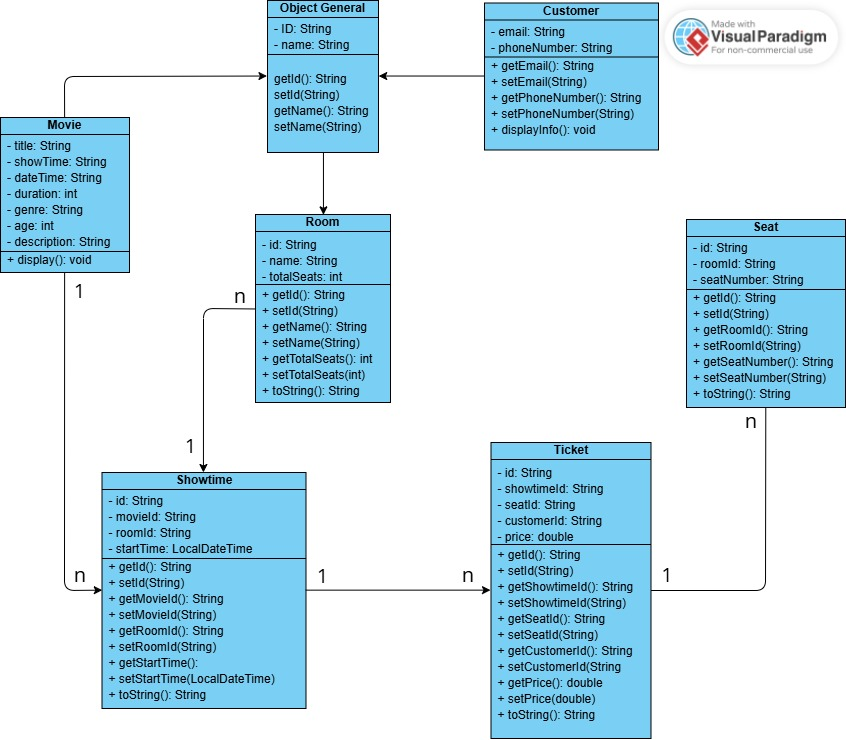
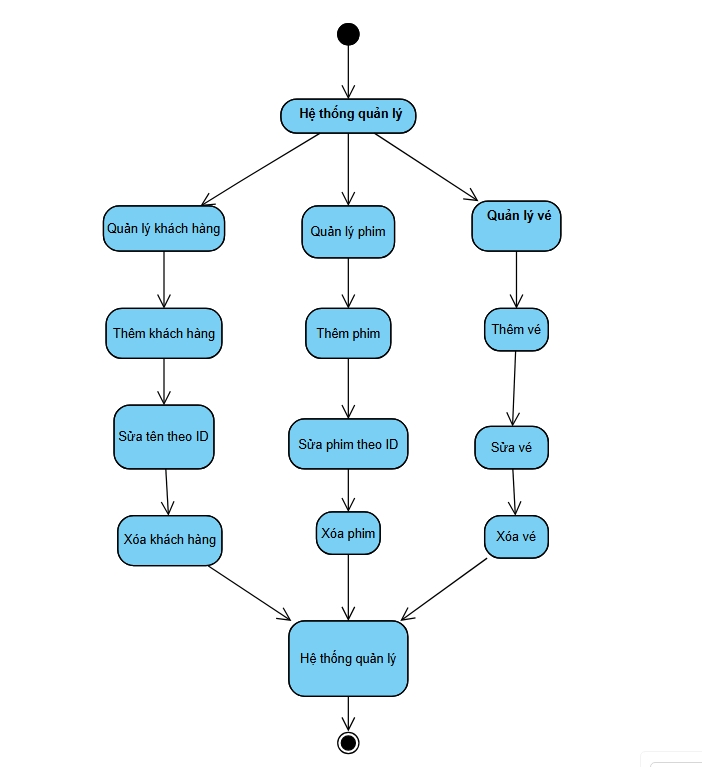
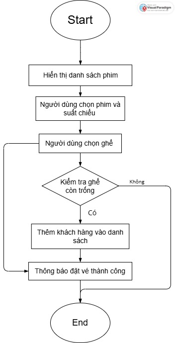

# Cinema Ticket Booking System - N04 Nhóm 8

## Thành viên nhóm
- Nguyễn Công Giáp - 22010369
- Hoàng Đức Thịnh - 23017255
- Giảng Viên Nguyễn Lệ Thu

---

## Mô tả dự án

**Cinema Ticket Booking System** là hệ thống quản lý và đặt vé xem phim trực tuyến, xây dựng bằng **Java Spring Boot**. Ứng dụng hỗ trợ quản lý toàn diện về phim, phòng chiếu, suất chiếu, ghế ngồi, vé, khách hàng và quy trình đặt vé.

---

## Chức năng chính

### Quản lý phim (Movie Management)
- Thêm, sửa, xóa, hiển thị danh sách phim
- Quản lý thông tin: tiêu đề, ngày phát hành, thời gian chiếu, thời lượng, thể loại, độ tuổi, mô tả
- Kiểm tra độ tuổi phù hợp cho khán giả

### Quản lý phòng chiếu (Room Management)
- Thêm, sửa, xóa, hiển thị danh sách phòng
- Quản lý thông tin: tên phòng, tổng số ghế

### Quản lý suất chiếu (Showtime Management)
- Thêm, sửa, xóa, hiển thị danh sách suất chiếu
- Liên kết phim với phòng chiếu và thời gian bắt đầu

### Quản lý ghế ngồi (Seat Management)
- Thêm, sửa, xóa, hiển thị danh sách ghế
- Quản lý ghế theo phòng và số ghế

### Quản lý khách hàng (Customer Management)
- Thêm, sửa, xóa, hiển thị danh sách khách hàng
- Quản lý thông tin: tên, email, số điện thoại
- Hệ thống đăng ký và đăng nhập

### Quản lý vé (Ticket Management)
- Thêm, sửa, xóa, hiển thị danh sách vé
- Liên kết vé với suất chiếu, ghế ngồi và khách hàng
- Quản lý giá vé
- Tìm kiếm và in vé

### Quy trình đặt vé (Booking Process)
- Chọn phim → Chọn suất chiếu → Chọn ghế → Xác nhận thông tin khách hàng
- Thanh toán và tạo vé
- In vé tự động

---

## Kiến trúc và Mô hình dữ liệu

### Lớp cơ sở (Base Classes)
1. **ObjectGeneral**
   - Lớp cơ sở cho tất cả các đối tượng
   - Thuộc tính: `id`, `name`
   - Phương thức: getter/setter cho id và name

2. **ObjectList<T extends ObjectGeneral>**
   - Lớp generic để quản lý danh sách các đối tượng
   - Hỗ trợ CRUD operations: Create, Read, Update, Delete
   - Sử dụng ArrayList để lưu trữ

### Các lớp Model chính

1. **Movie** (extends ObjectGeneral)
   - Thuộc tính: `title`, `showTime`, `dateTime`, `duration`, `genre`, `age`, `description`
   - Phương thức: `display()`, `isSuitableForAge(int viewerAge)`

2. **Customer** (extends ObjectGeneral)
   - Thuộc tính: `email`, `phoneNumber`
   - Phương thức: `displayInfo()`

3. **Room**
   - Thuộc tính: `id`, `name`, `totalSeats`
   - Phương thức: toString()

4. **Showtime**
   - Thuộc tính: `id`, `movieId`, `roomId`, `startTime` (LocalDateTime)
   - Phương thức: toString()

5. **Seat**
   - Thuộc tính: `id`, `roomId`, `seatNumber`
   - Phương thức: toString()

6. **Ticket**
   - Thuộc tính: `id`, `showtimeId`, `seatId`, `customerId`, `price`
   - Phương thức: toString()

### Các lớp List (Quản lý danh sách)
- **MovieList** (extends ObjectList<Movie>)
- **CustomerList** (extends ObjectList<Customer>)
- **TicketList** (extends ObjectList<Ticket>)

### Lớp Database Access (DAO)
- **AivenConnection**: Quản lý kết nối database
- **MovieDAO**: Thao tác dữ liệu phim
- **CustomerDAO**: Thao tác dữ liệu khách hàng
- **RoomDAO**: Thao tác dữ liệu phòng
- **SeatDAO**: Thao tác dữ liệu ghế
- **ShowtimeDAO**: Thao tác dữ liệu suất chiếu
- **TicketDAO**: Thao tác dữ liệu vé

### Controllers (Spring Boot)
- **MovieController**: Xử lý request liên quan đến phim
- **CustomerController**: Xử lý request liên quan đến khách hàng
- **RoomController**: Xử lý request liên quan đến phòng
- **SeatController**: Xử lý request liên quan đến ghế
- **ShowtimeController**: Xử lý request liên quan đến suất chiếu
- **TicketController**: Xử lý request liên quan đến vé
- **BookingController**: Xử lý quy trình đặt vé
- **TicketLookupController**: Xử lý tìm kiếm vé

---

## Công nghệ sử dụng

- **Java 17**
- **Spring Boot 3.3.0**
- **Spring Web MVC**
- **Thymeleaf** (Template Engine)
- **Spring JDBC** (Database Access)
- **MySQL 8.0.26** (Database)
- **Maven** (Build Tool)
- **Spring Boot DevTools** (Development)

---

## Cấu trúc dự án

```
springbootApp/complete/
├── src/
│   ├── main/
│   │   ├── java/com/example/servingwebcontent/
│   │   │   ├── model/                    # Các lớp model
│   │   │   │   ├── ObjectGeneral.java    # Lớp cơ sở cho tất cả đối tượng
│   │   │   │   ├── ObjectList.java       # Lớp generic quản lý danh sách
│   │   │   │   ├── Movie.java           # Model phim
│   │   │   │   ├── MovieList.java       # Quản lý danh sách phim
│   │   │   │   ├── Customer.java        # Model khách hàng
│   │   │   │   ├── CustomerList.java    # Quản lý danh sách khách hàng
│   │   │   │   ├── Room.java            # Model phòng chiếu
│   │   │   │   ├── RoomList.java        # Quản lý danh sách phòng
│   │   │   │   ├── Showtime.java        # Model suất chiếu
│   │   │   │   ├── ShowtimeList.java    # Quản lý danh sách suất chiếu
│   │   │   │   ├── Seat.java            # Model ghế ngồi
│   │   │   │   ├── SeatList.java        # Quản lý danh sách ghế
│   │   │   │   ├── Ticket.java          # Model vé
│   │   │   │   └── TicketList.java      # Quản lý danh sách vé
│   │   │   ├── database/                 # Lớp truy cập dữ liệu (DAO)
│   │   │   │   ├── AivenConnection.java  # Quản lý kết nối database
│   │   │   │   ├── MovieDAO.java        # DAO phim
│   │   │   │   ├── CustomerDAO.java     # DAO khách hàng
│   │   │   │   ├── RoomDAO.java         # DAO phòng
│   │   │   │   ├── ShowtimeDAO.java     # DAO suất chiếu
│   │   │   │   ├── SeatDAO.java         # DAO ghế
│   │   │   │   └── TicketDAO.java       # DAO vé
│   │   │   ├── Controllers/              # Spring Boot Controllers
│   │   │   │   ├── MovieController.java      # Xử lý request phim
│   │   │   │   ├── CustomerController.java   # Xử lý request khách hàng
│   │   │   │   ├── RoomController.java       # Xử lý request phòng
│   │   │   │   ├── ShowtimeController.java   # Xử lý request suất chiếu
│   │   │   │   ├── SeatController.java       # Xử lý request ghế
│   │   │   │   ├── TicketController.java     # Xử lý request vé
│   │   │   │   ├── BookingController.java    # Xử lý quy trình đặt vé
│   │   │   │   ├── LoginController.java      # Xử lý đăng nhập
│   │   │   │   ├── RegisterController.java   # Xử lý đăng ký
│   │   │   │   └── GlobalExceptionHandler.java # Xử lý lỗi toàn cục
│   │   │   ├── MainMenu.java             # Menu chính ứng dụng
│   │   │   ├── ValidationUtils.java      # Tiện ích validation
│   │   │   └── ServingWebContentApplication.java # Main class
│   │   └── resources/
│   │       ├── templates/               # Thymeleaf templates
│   │       │   ├── index.html           # Trang chủ
│   │       │   ├── login.html           # Trang đăng nhập
│   │       │   ├── register.html        # Trang đăng ký
│   │       │   ├── movie/               # Templates quản lý phim
│   │       │   │   ├── list.html        # Danh sách phim
│   │       │   │   ├── add.html         # Thêm phim
│   │       │   │   └── edit.html        # Sửa phim
│   │       │   ├── customer/            # Templates quản lý khách hàng
│   │       │   │   ├── list.html        # Danh sách khách hàng
│   │       │   │   ├── add.html         # Thêm khách hàng
│   │       │   │   └── edit.html        # Sửa khách hàng
│   │       │   ├── room/                # Templates quản lý phòng
│   │       │   │   ├── list.html        # Danh sách phòng
│   │       │   │   ├── add.html         # Thêm phòng
│   │       │   │   └── edit.html        # Sửa phòng
│   │       │   ├── showtime/            # Templates quản lý suất chiếu
│   │       │   │   ├── list.html        # Danh sách suất chiếu
│   │       │   │   ├── add.html         # Thêm suất chiếu
│   │       │   │   └── edit.html        # Sửa suất chiếu
│   │       │   ├── seat/                # Templates quản lý ghế
│   │       │   │   ├── list.html        # Danh sách ghế
│   │       │   │   ├── add.html         # Thêm ghế
│   │       │   │   └── edit.html        # Sửa ghế
│   │       │   ├── ticket/              # Templates quản lý vé
│   │       │   │   ├── list.html        # Danh sách vé
│   │       │   │   ├── add.html         # Thêm vé
│   │       │   │   ├── edit.html        # Sửa vé
│   │       │   │   ├── lookup.html      # Tìm kiếm vé
│   │       │   │   ├── lookup-result.html # Kết quả tìm kiếm
│   │       │   │   └── print.html       # In vé
│   │       │   └── booking/             # Templates đặt vé
│   │       │       ├── movies.html      # Chọn phim
│   │       │       ├── showtimes.html   # Chọn suất chiếu
│   │       │       ├── seats.html       # Chọn ghế
│   │       │       ├── customer.html    # Thông tin khách hàng
│   │       │       └── success.html     # Đặt vé thành công
│   │       └── application.properties   # Cấu hình ứng dụng
│   └── test/
│       └── java/com/example/servingwebcontent/
│           └── ServingWebContentApplicationTest.java # Test class
├── target/                              # Thư mục build
├── pom.xml                              # Maven configuration
├── build.gradle                         # Gradle configuration
├── gradlew                              # Gradle wrapper script
├── gradlew.bat                          # Gradle wrapper script (Windows)
└── settings.gradle                      # Gradle settings
```

### Cấu trúc thư mục chính:

1. **`main/TicketBookingApp/`** - Ứng dụng Java console cơ bản
2. **`springbootApp/complete/`** - Ứng dụng Spring Boot hoàn chỉnh
3. **`springbootApp/initial/`** - Template Spring Boot ban đầu

---

## Hướng dẫn chạy dự án

### Yêu cầu hệ thống
- Java 17 hoặc cao hơn
- MySQL 8.0 hoặc cao hơn
- Maven 3.6+

### Cài đặt và chạy

1. **Clone repository:**
   ```bash
   git clone https://github.com/22010369-sketch/00P_N04_25_26_CongGiap_DucThinh
   cd OOP_N04_25_26_CongGiap_DucThinh
   ```

2. **Cấu hình database:**
   - Tạo database MySQL
   - Cấu hình kết nối trong "AivenConnection.java"

3. **Build và chạy ứng dụng:**
   ```bash
   cd springbootApp/complete
   mvn clean install
   mvn spring-boot:run
   ```

4. **Truy cập ứng dụng:**
   ```
   [http://localhost:8080/](https://zero0p-n04-25-26-conggiap-ducthinh-1.onrender.com/)
   ```

---

## Tính năng nổi bật

### 1. Kiến trúc OOP
- Sử dụng kế thừa với `ObjectGeneral` làm lớp cơ sở
- Generic classes với `ObjectList<T>`
- Encapsulation với getter/setter methods

### 2. Database Integration
- Sử dụng Spring JDBC cho truy cập database
- DAO pattern cho tách biệt logic business và data access
- Connection pooling với Aiven

### 3. Web Interface
- Thymeleaf templates cho giao diện
- Responsive design
- Form validation
- Navigation fragments

### 4. Booking Workflow
- Multi-step booking process
- Real-time seat selection
- Ticket generation và printing
- Customer authentication

---

## Hình ảnh & sơ đồ

### 1. Class Diagram


### 2. Activity Diagram


### 3. Lưu đồ thuật toán


---

## Liên kết

- [GitHub Repository](https://github.com/22010369-sketch/00P_N04_25_26_CongGiap_DucThinh)
- [README.md trên GitHub](https://github.com/22010369-sketch/00P_N04_25_26_CongGiap_DucThinh/blob/master/README.md)

